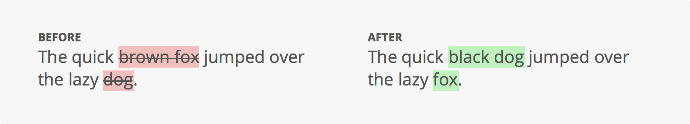

diffChineseBot
===========

## 介绍
该模块对两个字符串进行比较并输出差异。

它基于John Resig的Javascript Diff算法(http://ejohn.org/projects/javascript-diff-algorithm/)，并大量借鉴了该算法。

主要区别在于，该模块支持在包含中文或其他使用多字节字符和/或不使用空格分隔单词的语言的字符串中查找差异。

使用效果:




### npm安装

```bash
$ npm install diffchinesebot
```

### RequireJS (推荐引入方式)
```javascript
require.config({
	paths: {
		diffChinese: './diffChineseBot/index.js'
	}
});

require( [ 'diffChinese' ], function( diffChinese ) {
	...
});

```

### 直接引用
```html
<script src="./diffChineseBot.js"></script>
<script>
window.diffChinese(oldStr, newStr, point)
</script>
```

## 使用方式

diffChineseBot包只包含一个函数diffChinese，可以这样使用:
```javascript
var beforeString = 'the quick brown fox';
var afterString = 'the quick brown dog';
var point = 1

var diff = diffChinese( beforeString, afterString, point );

// => { before: 'the quick brown <del>fox</del>', after: 'the quick brown <ins>dog</ins>' }
```

第一个参数：旧字符串	String

第二个参数：新字符串	String

第三个参数：不匹配度 	Number 默认可不传 不匹配度高于设定将不再进行比对高亮

样式类名

del-text  旧文本不匹配文本

new-text  新文本不匹配文本